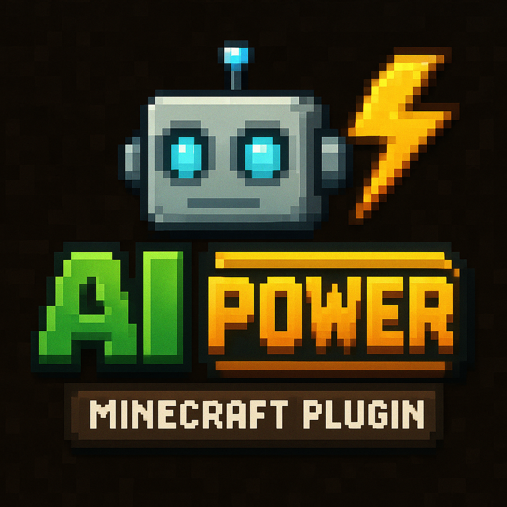

<div align="center">
  <a href="https://www.spigotmc.org/resources/ai-power.128423/" target="_blank">
    
  </a>
</div>

# 🤖 AI Power Plugin

**Bring AI assistants to your Minecraft server!** Let your players chat with OpenAI GPT, Claude, or other AI models right from the game.

- Spigot resource page, visit <a href="https://www.spigotmc.org/resources/ai-power.128423/" target="_blank">here</a>.

## 🎯 What does this do?

Players can ask AI questions directly in Minecraft:

```
/ai How do I make a redstone clock?
/ai What's the best way to find diamonds?
/ai Tell me a joke about creepers
```

The AI responds in chat with helpful, family-friendly answers tailored for Minecraft players.

## 🚀 Quick Start

1. **Download the plugin:**

   - Get the latest release from [GitHub Releases](https://github.com/marcodluz/ai-power-plugin/releases)
   - Download the latest version.

2. **Install:**

   - Drop the JAR file into your server's `plugins/` folder
   - Restart your server

3. **Configure an AI provider:**
   Edit `plugins/AIPowerPlugin/config.yml` and add your API key:

   **For OpenAI (easiest):**

   ```yaml
   plugin:
     default-provider: "openai"

   ai-providers:
     openai:
       api-key: "sk-your-openai-key-here"
       model: "gpt-3.5-turbo"
   ```

   **For AWS Bedrock:**

   ```yaml
   plugin:
     default-provider: "bedrock"

   ai-providers:
     bedrock:
       access-key-id: "your-aws-access-key"
       secret-access-key: "your-aws-secret-key"
       region: "us-east-1"
   ```

4. **Reload and test:**
   ```
   /ai reload
   /ai Hello, can you help me with Minecraft?
   ```

## 💬 Commands

| Command              | What it does                        |
| -------------------- | ----------------------------------- |
| `/ai <your message>` | Chat with the AI assistant          |
| `/ai help`           | Show available commands             |
| `/ai info`           | Check if AI is working              |
| `/ai config`         | View current settings (admins only) |
| `/ai reload`         | Reload configuration (admins only)  |

## ⚙️ Supported AI Providers

- **OpenAI** - GPT-3.5, GPT-4 (recommended for beginners)
- **Azure OpenAI** - Enterprise OpenAI deployments
- **Anthropic** - Claude models via direct API
- **AWS Bedrock** - Claude models via AWS (enterprise)

Just set `default-provider` in config.yml to your preferred option.

## 🛡️ Safety Features

- **Response length limits** - Prevents chat spam
- **Rate limiting** - Stops AI abuse
- **Family-friendly prompts** - AI knows it's talking to Minecraft players
- **Error handling** - Graceful failures, no server crashes
- **Admin controls** - Full permission system

## 🔧 Advanced Configuration

```yaml
plugin:
  default-provider: "openai"
  max-response-length: 500 # Prevent long AI responses
  debug: false # Enable for troubleshooting

ai-providers:
  openai:
    api-key: "your-key-here"
    model: "gpt-3.5-turbo" # or gpt-4, gpt-4-turbo
    max-tokens: 150 # Response length
    temperature: 0.7 # Creativity (0.0-1.0)

rate-limiting:
  enabled: true
  requests-per-minute: 5 # Per player
  cooldown-seconds: 10

messages:
  system-prompt: "You are a helpful assistant in a Minecraft server. Keep responses concise and family-friendly. Help with game questions but avoid exact coordinates or major spoilers."
```

## 🚨 Requirements

- **Java 17+** and **PaperMC 1.20.4+**
- **An AI provider account** (OpenAI account costs ~$5-20/month for typical usage)

## ❓ Common Issues

**"AI provider not configured"** → Check your API key in config.yml  
**Long response times** → AI providers sometimes have delays, this is normal  
**Rate limit errors** → Adjust `requests-per-minute` in config

## 🛠️ For Server Owners

This plugin is designed to be **low-maintenance**:

- Async processing won't lag your server
- Built-in rate limiting prevents abuse
- Comprehensive error handling
- Easy configuration management

Perfect for creative servers, help channels, or just adding some fun AI interaction!

## 🔨 Building from Source

Want to modify the plugin or contribute?

```bash
git clone https://github.com/marcodluz/ai-power-plugin.git
cd ai-power-plugin
./gradlew build
```

The JAR will be in `build/libs/ai-power-plugin-1.0.0.jar`

---

**Made with ❤️ for the Minecraft community**
